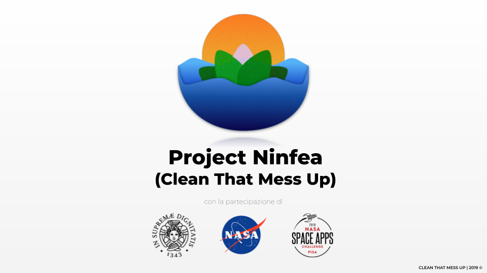
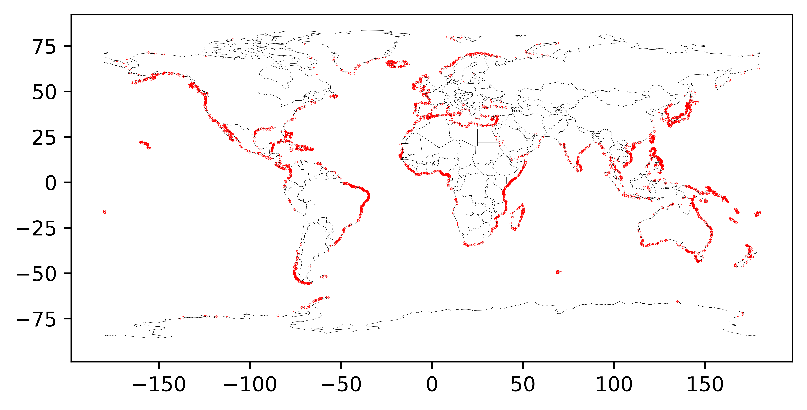
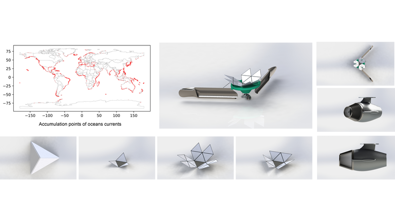

# CleanThatMessUp
This repo was used to support [our idea](https://2019.spaceappschallenge.org/challenges/earths-oceans/trash-cleanup/teams/cleanthatmessup/project) for the [NASA Space Apps Challenge 2019](https://www.spaceappschallenge.org/).



### Dataset
The dataset used is the [gdp_interpolated_drifter](http://osmc.noaa.gov/erddap/tabledap/gdp_interpolated_drifter.html), offered by the [NOAA](https://www.noaa.gov/) agency. The project uses a [restricted version](http://osmc.noaa.gov/erddap/tabledap/gdp_interpolated_drifter.csv?ID%2Celat%2Celon&distinct()) of the dataset in which only end coordinates and ID have been used.
The dataset is used in the article [Garbage Patch Visualization Experiment](https://svs.gsfc.nasa.gov/4174) from NASA.

### Install
```bash
pip3 install -r requirements.txt
mkdir data img
wget -O ./data/small.csv http://osmc.noaa.gov/erddap/tabledap/gdp_interpolated_drifter.csv?ID%2Celat%2Celon&distinct()
```

### Run
```bash
python3 compute_coast_dist.py
python3 plot_coast.py
```

### Results


-------------------------------------------------------------------

# Project Ninfea
We aim to filter water and collect the micro-plastic near the coasts to mitigate the micro-plastic problem. Our project proposes to build an autonomus GPS based robot powered by renewable energy that works in bounded areas.


**THE PROBLEM**
A great amount of plastic is focusing on the coast, that is causing an artificial island that is disintegrating into micro-plastic. The micro-plastic is being eaten by planktons, thus enterning food chain.


**OUR SOLUTION**
Analyzing NASA and NOAA Data we discovered the main accumulation point of ocean currents which we hypotize to be an accumulation point for plastic trash. We have designed a solution to filter water and collect the micro-plastic where the plastic accumulates. Our project proposes to build an autonomus GPS based robot waterlily shaped powered by renewable energy that works in bounded areas.


**IMPLEMENTATION**
Project Ninfea, the name of our solution, is a filtering system that use films to trigger an inducted crossflow which grants self-cleaning and the redirection of accumulated debris. The system is powered by a outboard hydrojet naval engine, designed by an italian startup, which it has a filter that allow to filter large water flow rates. There also other filters disposed Project Ninfea which allows to filter the micro-plastic above the sea surface and they grant to cover a wide area.

The robots work during night and day and they recharge through the morning solar energy and also the wave motion.




**REFERENCES**
- OSMC - NOAA: https://bit.ly/2N1hZ7E
- NASA SVS Garbage Patch: https://go.nasa.gov/2O7tyJM 
- Open Street Map: https://www.openstreetmap.org


**SLIDES (IN ITALIAN)**
- [Google Slides](https://bit.ly/CTMUslide)
- [PDF](src/slides.pdf) (without gifs)
- [Video Rendering](src/rendering.mp4)
